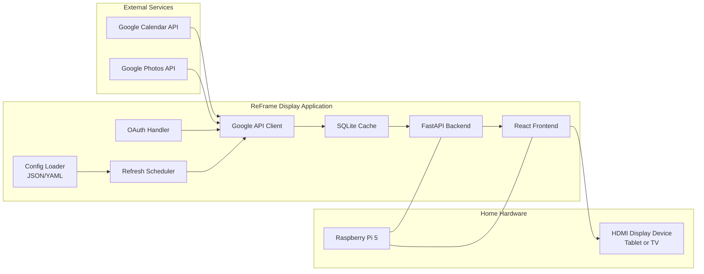

# Architecture Overview

This document is the canonical system architecture reference for ReFrame Display.

## System Diagram

## Runtime Flow

1. Config loader reads display mode and refresh interval.
2. Scheduler triggers periodic sync (default 15 minutes, configurable).
3. OAuth handler authenticates each user directly with provider accounts.
4. Google API client fetches calendar and photos data.
5. Backend caches data in SQLite.
6. Frontend reads prepared data from backend APIs.
7. Content is rendered in HDMI kiosk mode or web app mode.

## Deployment Modes

- HDMI kiosk mode: passive, full-screen display output.
- Web app mode: browser-based mode that is touch-ready for future interactive features.

## Evergreen Maintenance Rules

Use these rules to keep this architecture page current as the project evolves:

1. If a component is added, removed, or renamed, update this diagram in the same pull request.
2. If data flow changes, update both the diagram and Runtime Flow list.
3. If configuration behavior changes, reflect it in this file and docs/setup.md.
4. Keep diagram labels implementation-agnostic where possible so upgrades (for example Raspberry Pi to Jetson) do not require redesigning the document.
5. Treat this file as the source of truth for architecture references in other docs.

## Change Checklist

Before merging architecture-impacting changes, confirm:

- Diagram still matches actual components.
- Runtime Flow steps are still accurate.
- Mode behavior matches current implementation.
- README links to this page remain valid.
